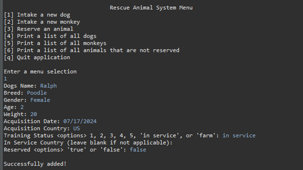
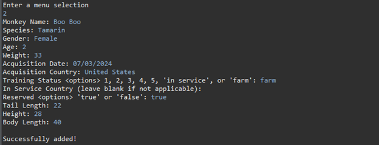
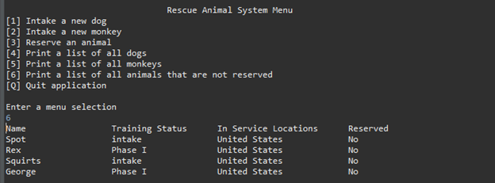
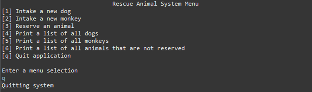

# To Run: 
1. Install JRE or JDK
2. Add the JDK or JRE bin folder to PATH
3. Download 'Rescue Animal.zip'
4. Extract 'Rescue Animal.zip'
5. Execute run.bat in the 'RescueAnimal' directory

# Rescue Animal (Java)
This is a program to keep track of a list of  animals. The user can add dogs and monkeys and their associated attributes to storage. The user may also print various lists if desired.

