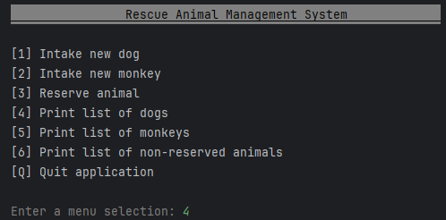
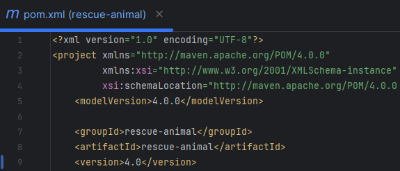
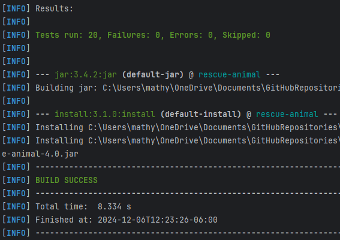
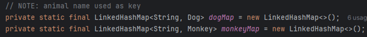
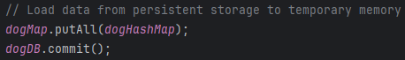
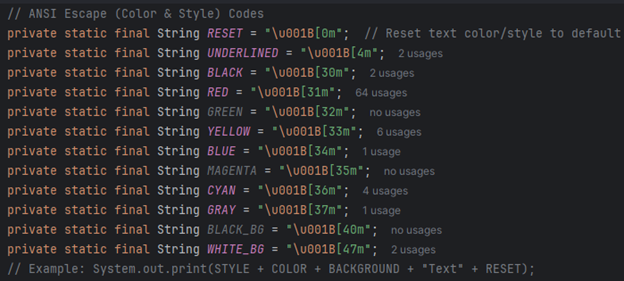
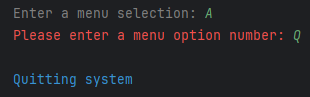

# Rescue Animal Management System (Java)
This is a simple text-based program that keeps track of rescue animals. 
The user can add new dogs and monkeys (and their attributes) to temporary storage using Java ArrayLists. 
The user can also print out a list of dogs or monkeys or a list of all non-reserved animals.

## Project Summary
I wrote this program a couple of years ago at SNHU. I chose this project because it needed lots of work done to it to provide a better user experience and a more secure, robust application. I ended up making quite a few changes in the areas of software engineering and design, data structures, and databases. I go into more detail in my [Code Review Video](https://www.youtube.com/watch?v=heo30ZFu5Eg&ab_channel=alienhead) on YouTube. You should check it out!

 

### Rescue Animal Enhancements (v4.0):
Added Error-Handling and Input Validation: 
 

Converted to Maven Framework: 
 
 

Implemented JUnit Unit Testing: 
 
 

Converted ArrayList to LinkedHashMap 
From O(n) to O(log n) worst-case time complexity: 
 

Added Persistent Storage: 
 
 

Added Custom Text Colors and Styles: 
 
 
 
 
