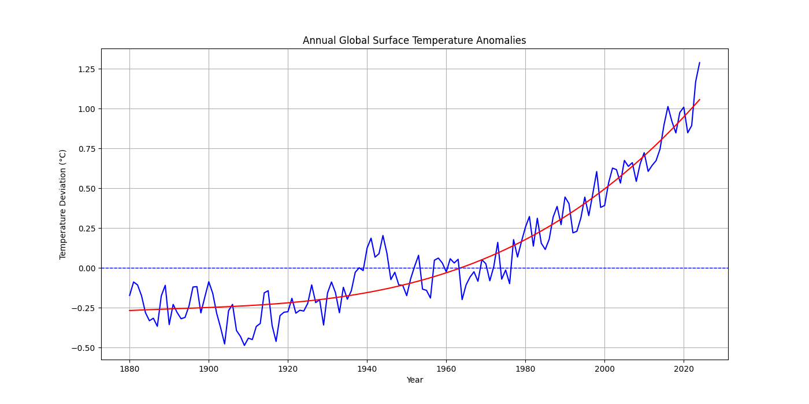

### Python Data Analysis Script
The last thing I did as part of my experiential learning for data analyses was create a Python script that plotted global temperature deviations using a dataset from NASA. I utilized the Python libraries numpy, pandas, and matplotlib to do this. I chose this artifact because it was the cumulative deliverable I created, and I felt most proud of it. This is a real-world example of using technology to interact with and understand data. I will use this experience in my future software development projects to integrate data analytics and machine learning into my software applications. Because without data, there is no app.
 

#### Output:

 

### Certificate for Data Analytics:

