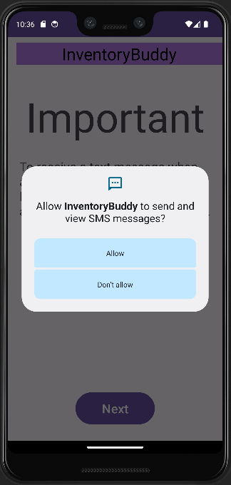
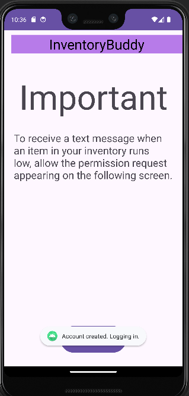
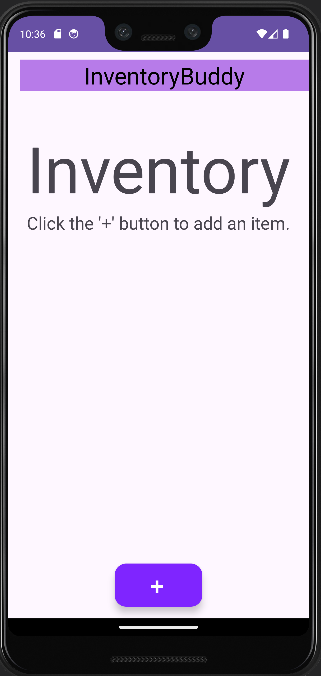
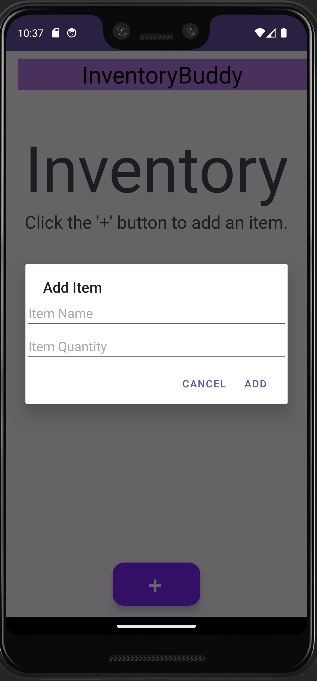
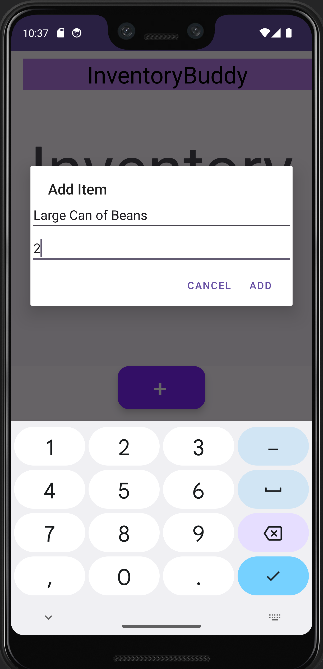
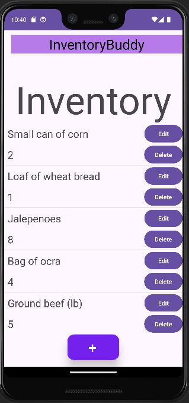

### InventoryBuddy (Main Project)  

InventoryBuddy is a simple mobile app designed to allow secure access to a personal inventory of tracked items and associated quantities. After entering in a username and password, the account is created (if not found), and the user is logged in. They are then alerted about the upcoming SMS permission request that will allow SMS notifications to be received whenever an item is running low (only 1 left). After accepting or rejecting the permission request, the user can now access their personal inventory. Each item consists of a name and quantity attribute, and the user may edit or delete any item name or quantity at any time. The user may add items by clicking the attractive, “+” floating action button centered at the bottom of the screen.
A user-centered design was implemented that includes an easy-to-see user interface (UI) with a simple, but complimentary, color scheme. Contrast ratios of at least 3:1 (to 4.5:1 for smaller text) are used for text and background, as recommended by the Web Content Accessibility Guidelines (WCAG), provided by the World Wide Web Consortium (W3C, n.d.) with their Web Accessibility Initiative (WAI). All overlapping text had their contrast ratio verified using an online contrast checker tool from WebAIM (n.d.). The app was designed for effectiveness and efficiency and focused on user experience (UX) at the forefront of its design. 

After beginning the development of this mobile app, I focused on creating a modern MVVM (Model-View-ViewModel) architecture and a Repository pattern. I made sure to implement separation of concerns, asynchronous tasks, reactive and layered UIs, and other modern, robust techniques involving clean and modular code. To ensure code was functional, I statically and dynamically tested the code thoroughly and included try-catch blocks and log messages throughout, as well as considering null and edge cases. While debugging, these try-catch blocks make troubleshooting significantly easier and more effective, as you step through the code a line at a time. At one point, my app would crash immediately upon showing the Android splash screen, and implementing try-catch blocks, as well as custom (enum) error states, were used to overcome challenges like this. I made sure to keep the user at the center of design and development, and I provided the user with a multitude of toast message feedback, which I believe was well executed. The ViewModel class converts LiveData received from the Repository and is then observed by the Activity/Fragment, which supports separation of concerns and a reactive and layered UI, as recommended by Google (Android Developer, n.d.). I look forward to designing and building more innovative and interesting software applications on new and emerging platforms and devices. Thank you for reading!

References:
Android Developer. (n.d.). Modern App Architecture. Google. https://developer.android.com/topic/architecture#modern-app-architecture. 
WebAIM. (n.d.) Contrast Checker. https://webaim.org/resources/contrastchecker/. 
World Wide Web Consortium (W3C). (n.d.). https://www.w3.org/WAI/WCAG21/Understanding/contrast-minimum. 
