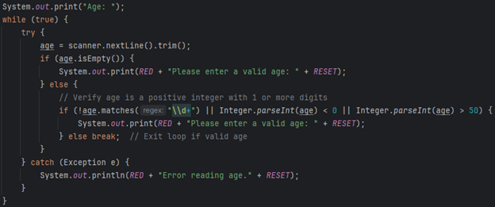

## Project Summary
This project involved choosing a previously written program and enhancing it in various ways. I chose a program I wrote a couple of years ago at SNHU. I knew this program needed lots of work in order to provide a better user experience and a more secure, robust application. I ended up making quite a few changes in the areas of software engineering and design, run-time optimization, database implementation, and modularization. I go into more detail in my [Code Review Video](https://www.youtube.com/watch?v=heo30ZFu5Eg&ab_channel=alienhead) on YouTube. You should check it out!

### Rescue Animal Management System (Java)
This is a simple text-based program written in Java that keeps track of rescue animals. 
The user can add new dogs and monkeys (and their attributes) to temporary storage. 
The user can also print out a list of dogs or monkeys or a list of all non-reserved animals. 

 

### Program Enhancements:
Added Error-Handling and Input Validation: 
 

Converted to Maven Framework: 
 
 

Implemented JUnit Unit Testing: 
 
 

Added Custom Text Colors and Styles: 
 
 
 
 

Added Persistent Storage: 
 
 

Optimized from O(n) down to O(log n) worst-case time complexity: 
 
 
