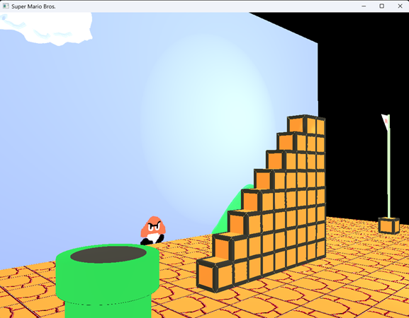

### Super Mario Bros (C++/OpenGL)
In this project, I've created a classic scene from Nintendo's Super Mario Bros. on Nintendo Entertainment System (NES). I created all meshes/images seen here. Aside from the pipe, I completely coded all of the shapes and objects, and I positioned and scaled them in 3D space, as well as added lighting. I also implemented 3D movement for the user. The user can navigate the 3D scene and switch between an orthogonal and projection view to provide either a 2D or 3D perspective, as seen below.

### TO RUN:
1.	Download project as a ZIP
2.	Extract ZIP
3.	Open "RUN TO START" in project root directory
